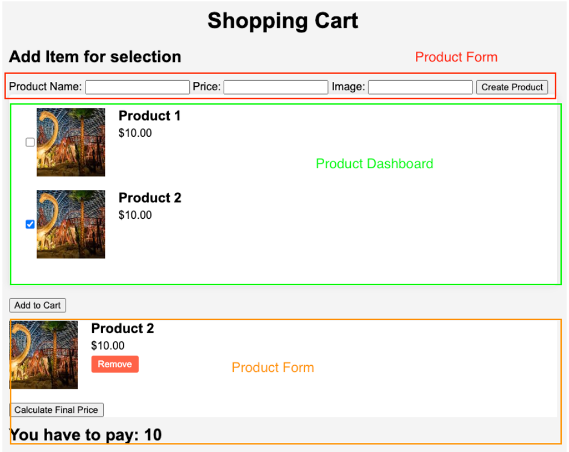

# Title: Javascript Assessment
[Link](https://js-dom-cart.vercel.app/)

## Description:

> Our client would like to create ecommerce websites. They are very concerned about the Cart feature. Because a previous vendor can’t accomplish what they want. Our team responsibility is to do a minimum viable product (MVP) that demonstrates a cart feature to the client.

## Requirements:

---

- Thinking Process (4 points)

### Handle form input to create a new item to the product dashboard.

(11 points)

- Form consists of 3 input fields (Product Name, Price, and Image) and a Create Product button. (3 points)

> Form validation including:

- price/quantity must be only a number. (2 points)
- image URL must be a file with (jpg, png, gif) extension.
  (1 points)
- When a user clicks to create a product. A new product should be created and inserted into the dashboard. (5 points)

---

- Thinking Process (2 points)

### Handle user selection items from the product dashboard. (1 points)

- Users can select multiple products at once. (1 points)

---

- Thinking Process (7 points)

### Handle Cart section. (15 points)

- When the user clicks add to cart. The selected products should be added to cart. (5 points)
- If the user re-select product from the dashboard and clicked add to cart, the current product in the cart should be updated relatively. (5 points)
  > For example, users select item A and B and add them to cart. Now carts have A,B. If the user unchecked B out of the list and clicks add to cart again. The cart should have only A.
- When the cart is created, the calculated final price button should appear. (2 points)
- When this button is clicked, some algorithm should calculate all prices for the selected item in the cart. (3 points)

---

### BONUS (no point):

- Users can edit items in the product dashboard.

---
## UI

### Video: [Link](https://drive.google.com/file/d/1Th5vwh1TiRKgQJrPC_RJgYtWN-bkmFfY/view?usp=sharing)
